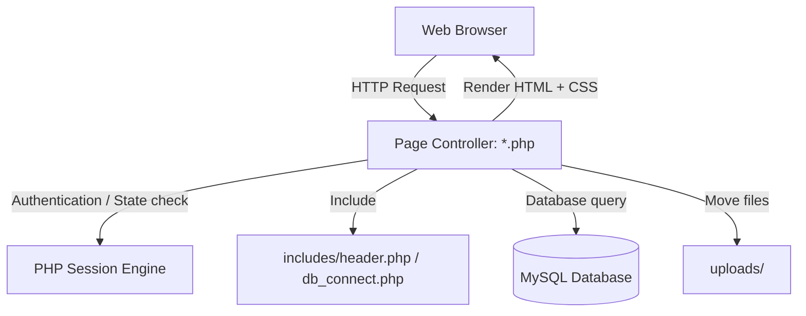
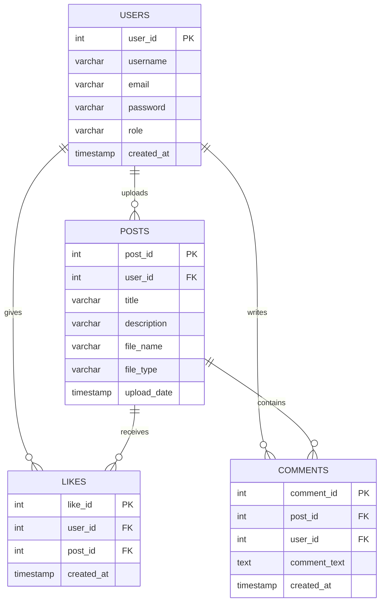

# Calligraphy Central - Architectural Specification

This document details the architectural design, patterns, database structure, and execution flow of the Calligraphy Central application.

---

## 1. Architectural Patterns

Calligraphy Central follows the **Page Controller Pattern**:
*   Every `.php` file acts as both the controller and the view template.
*   Request processing (handling POST forms, session checks) occurs at the top of the file, while HTML generation occurs at the bottom.
*   **Templating**: Reusable components (`header.php`, `footer.php`) are included dynamically to wrap content and inject the CSS layout.
*   **State Management**: Standard PHP native sessions (`session_start()`) manage logged-in states, roles, and feedback.

---

## 2. Technical Component Layout

### 2.1 Code Organization
*   `/includes/db_connect.php`: Instantiates the `$conn` object using MySQLi. Handles connection failures.
*   `/includes/header.php`: Outputs `<!DOCTYPE html>`, includes stylesheets, sets up Google Fonts, and renders the header navigation menu based on session authorization.
*   `/includes/footer.php`: Closes standard page containers and prints copyright details.
*   `/style.css`: Contains CSS rules (using layout grids, typography configurations, colors, and responsive queries).

### 2.2 Relational Schema Details

---

## 3. Data Processing Flows

### 3.1 Upload Flow (`upload.php`)
1.  **Session Verification**: Confirms `$_SESSION['user_id']` is initialized.
2.  **Size Guarding**: Inspects content lengths to capture post payloads exceeding limits before processing.
3.  **Backend Validation**: Restricts post descriptions to 400 characters, checking media sizing against a hard 50MB ceiling.
4.  **MIME mapping**: Inspects target file extensions to categorize inputs as `image/` or `video/` type values.
5.  **Persistence**: Writes files to the `uploads/` folder and inserts post meta records into the database via parameterized SQL.

### 3.2 Gallery Loading Flow (`gallery.php`)
1.  Initiates a join query connecting `posts` and `users` to fetch raw metadata.
2.  Executes subqueries inside the SQL select block to dynamically fetch like totals (`like_count`) per post.
3.  Loops over results, rendering either standard images or video controls in the HTML response.
4.  Displays moderation actions (delete links) to users whose `$_SESSION['role']` matches `admin`.

---

## 4. Extension Points for AI Agents

To support the Google × Kaggle Agentic AI Capstone:
*   **`api/`**: Serves as the designated routing folder for clean JSON endpoints. Agents can expose endpoints to query site usage stats, search comments, or check database health without altering existing pages.
*   **`python_ai/`**: Serves as the home for LLM integrations, retrieval scripts, and local models. It interacts with the PHP application through standard API calls or direct database updates.
*   **`agents/`**: Houses independent process scripts that run in the background (e.g. log parsers, automatic image description generators, and automated content moderators).
