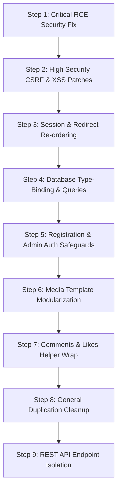

# Calligraphy Central - Refactoring Plan

This document details the refactoring roadmap and security remediation plan for Calligraphy Central. In strict compliance with `PROJECT_CONSTITUTION.md`, all proposed steps prioritize **backward compatibility, visual continuity, and risk minimization**, deferring all logic modifications until execution approval.

---

## 1. Suggested Implementation Roadmap

The recommendations are ordered chronologically to address critical security holes first, followed by structural encapsulation:

---

## 2. Refactoring & Remediation Recommendations

### 2.1 Critical Security Fix: RCE Validation in Edit Mode
*   **Purpose**: Neutralize the Remote Code Execution (RCE) vector by enforcing strict file extension validation when replacing artwork in edit mode.
*   **Files Involved**: `edit_posts.php`
*   **Risk Level**: Low (adding defensive validation controls).
*   **Dependencies**: None.
*   **Suggested Implementation Order**: **Step 1** (Highest priority).

---

### 2.2 CSRF Protection Engine
*   **Purpose**: Implement unique session-bound tokens for form submissions to block Cross-Site Request Forgery (CSRF).
*   **Files Involved**: `upload.php`, `edit_posts.php`, `like_posts.php`, `submit_comments.php`, `delete_post.php`, `includes/header.php`.
*   **Risk Level**: Medium (affects user submission pathways; forms must include hidden fields).
*   **Dependencies**: Session Handling Improvements.
*   **Suggested Implementation Order**: **Step 2**.

---

### 2.3 Attribute Escaping in Admin Dashboard
*   **Purpose**: Neutralize XSS and HTML attribute escapes by passing database-sourced filenames and MIME types through escaping filters before rendering.
*   **Files Involved**: `admin_dashboard.php`
*   **Risk Level**: Low.
*   **Dependencies**: None.
*   **Suggested Implementation Order**: **Step 2.5**.

---

### 2.4 Session Lifecycle & Redirect Re-ordering
*   **Purpose**: Correct the `"Headers already sent"` flaw. Restructure pages to check login status, handle form POST calculations, and evaluate redirects *before* including `includes/header.php`.
*   **Files Involved**: `login.php`, `register.php`, `admin_dashboard.php`, `delete_post.php`, `upload.php`, `my_posts.php`, `edit_posts.php`.
*   **Risk Level**: Medium (requires verified testing of login cookies and redirection headers).
*   **Dependencies**: None.
*   **Suggested Implementation Order**: **Step 3**.

---

### 2.5 Database Access & Type-Binding Alignment
*   **Purpose**: Replace nested queries with efficient joins and align parameter bindings (e.g. binding `user_id` as `"i"` instead of `"s"`).
*   **Files Involved**: `includes/db_connect.php`, `my_posts.php`, `gallery.php`, `view_post.php`.
*   **Risk Level**: Low.
*   **Dependencies**: None.
*   **Suggested Implementation Order**: **Step 4**.

---

### 2.6 User Registration Validation Policies
*   **Purpose**: Enforce password strength rules (e.g., minimum length of 8 characters) and username complexity bounds to protect credentials.
*   **Files Involved**: `register.php`
*   **Risk Level**: Low (only affects new registrations).
*   **Dependencies**: None.
*   **Suggested Implementation Order**: **Step 5**.

---

### 2.7 Media Rendering Modularization
*   **Purpose**: Extract the repeated `image` vs `video` HTML renderer check into a helper function `render_media($file_name, $file_type)`.
*   **Files Involved**: `gallery.php`, `admin_dashboard.php`, `my_posts.php`, `view_post.php`, and a new helper file `includes/media_helper.php`.
*   **Risk Level**: Low.
*   **Dependencies**: None.
*   **Suggested Implementation Order**: **Step 6**.

---

### 2.8 Comments & Likes Execution Wrappers
*   **Purpose**: Abstract query operations for likes toggling and comment publishing into structured functions: `toggle_like($user_id, $post_id)` and `add_comment($user_id, $post_id, $comment_text)`.
*   **Files Involved**: `like_posts.php`, `submit_comments.php`, `view_post.php`, and a new helper file `includes/interaction_helper.php`.
*   **Risk Level**: Low.
*   **Dependencies**: Database Access Improvements.
*   **Suggested Implementation Order**: **Step 7**.

---

### 2.9 Utility Duplication Reduction
*   **Purpose**: Centralize output escaping, sanitization, and session checking utilities into a global file `includes/utils.php`.
*   **Files Involved**: All page controllers.
*   **Risk Level**: Low.
*   **Dependencies**: None.
*   **Suggested Implementation Order**: **Step 8**.

---

### 2.10 Future REST API Isolation
*   **Purpose**: Introduce headless JSON endpoints under `/api/` to allow autonomous agents and python extensions to securely query data.
*   **Files Involved**: `/api/posts.php`, `/api/likes.php`, `/api/comments.php`, `/api/auth.php` (All [NEW] files).
*   **Risk Level**: Low (isolated scripts, no modification to active web pages).
*   **Dependencies**: Refactored Helper Modules.
*   **Suggested Implementation Order**: **Step 9**.
