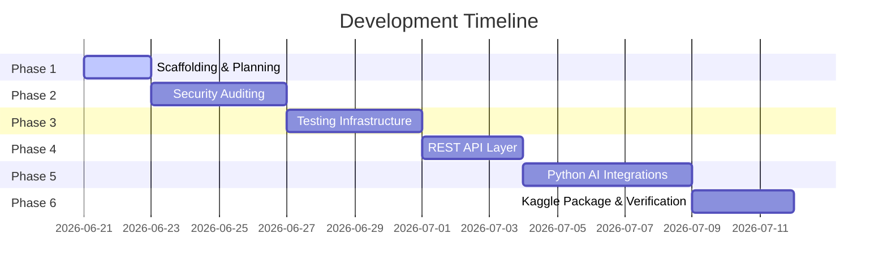

# Calligraphy Central - Development Roadmap

This roadmap outlines the phases of transforming Calligraphy Central from a legacy PHP repository into an Agentic AI-integrated web system.

---

---

## Phase 1: Scaffolding, Documentation & Skills (Current)
*   **Goal**: Establish clear architecture constraints, setup manuals, and folder layers.
*   **Tasks**:
    *   Create base documentation files (`README.md`, `PROJECT_CONSTITUTION.md`, `PROJECT_SPEC.md`, `ARCHITECTURE.md`, `CAPSTONE_REQUIREMENTS.md`, `ROADMAP.md`, `TODO.md`).
    *   Set up `.agent/skills/` directory containing specialized instruction guides.
    *   Create empty folders for environment isolation (`docs/`, `agents/`, `memory/`, `competition/`, `evaluation/`, `python_ai/`, `api/`, `assets/`).

## Phase 2: Security Audit & Code Remediations
*   **Goal**: Secure the legacy application without changing user-facing layout.
*   **Tasks**:
    *   Audit authentication flows and password storage mechanisms.
    *   Identify raw SQL queries and rewrite them as parameterized prepared statements (e.g., in `delete_post.php`, `like_posts.php`, `view_post.php`, `login.php`).
    *   Escape all user inputs (`htmlspecialchars()`) on feed/comment renders to neutralize Cross-Site Scripting (XSS).
    *   Address file upload security (verifying file extensions, content types, and locking directories).

## Phase 3: Testing Engineering & Verification
*   **Goal**: Validate compatibility and prevent regressions during updates.
*   **Tasks**:
    *   Configure test suites under `evaluation/`.
    *   Create script-based regression checks targeting login, registration, and post upload flows.
    *   Build end-to-end integration tests using mock databases.

## Phase 4: API Design & Core Connectivity
*   **Goal**: Expose website data structures to the Python agentic layer.
*   **Tasks**:
    *   Create standard JSON-based PHP endpoints in `api/` (e.g. `api/get_feed.php`, `api/post_artwork.php`, `api/auth.php`).
    *   Ensure all API endpoints follow the project constitution's security rules (requiring token auth or session auth).

## Phase 5: Python AI Agent Layer
*   **Goal**: Implement agent processes under `python_ai/` and `agents/`.
*   **Tasks**:
    *   Integrate LLM calls (e.g., Gemini models) to perform automatic artwork analysis.
    *   Build AI moderation agents to inspect comments for toxic statements before they publish.
    *   Write agent logic to log states to `/memory/`.

## Phase 6: Competition Package & Submission
*   **Goal**: Ensure clean deployment and scoring in the Kaggle environment.
*   **Tasks**:
    *   Consolidate all configs and runner scripts into `/competition/`.
    *   Profile agent token efficiency and memory logs.
    *   Verify offline sandbox execution compatibility.
    
