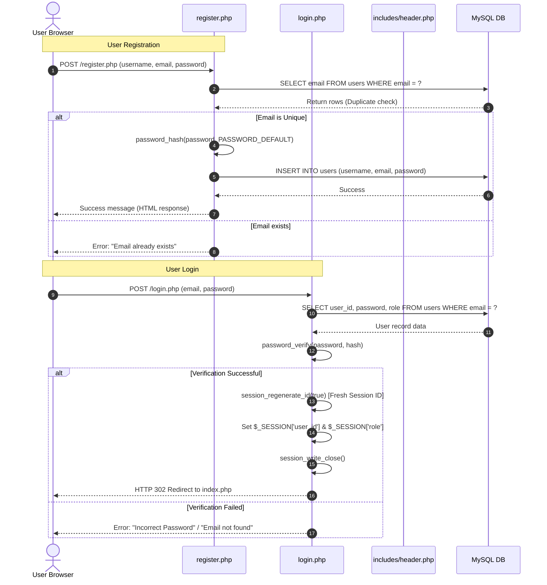
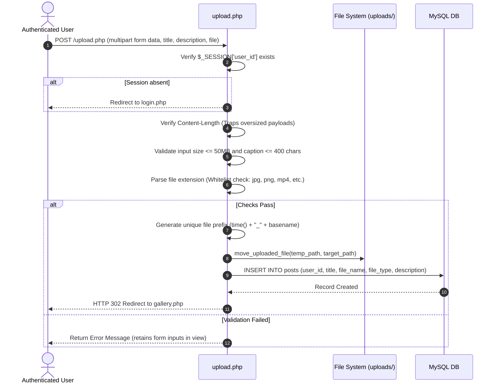
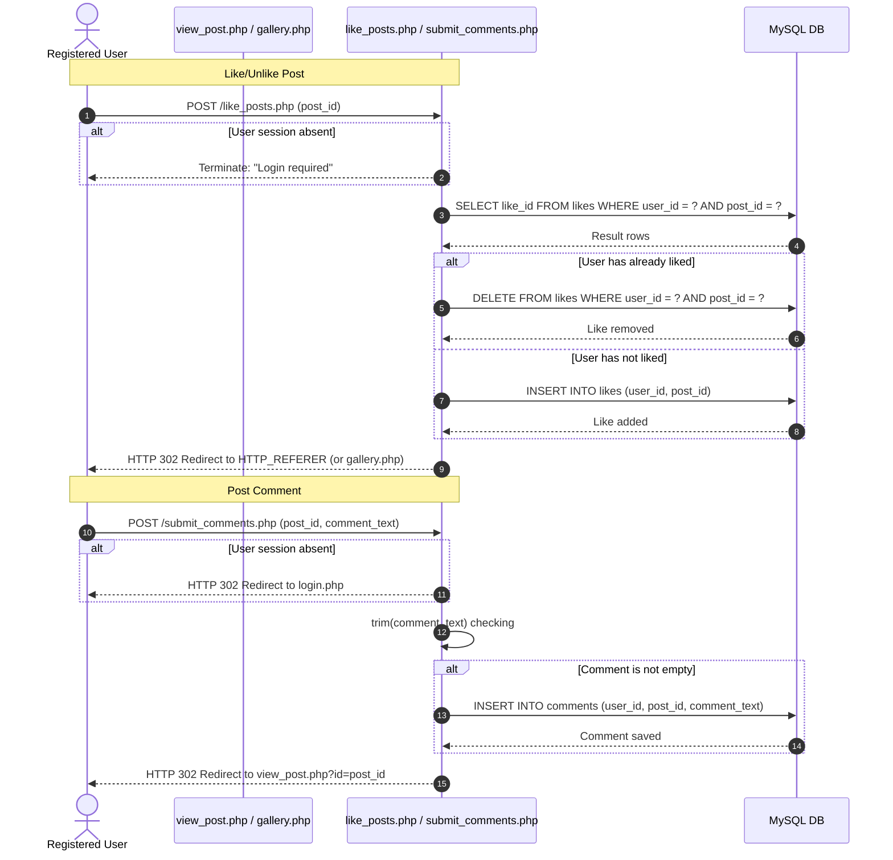

# Detailed System Architecture and Security Audit

This document provides a reverse-engineered specification of Calligraphy Central. It details page dependencies, runtime execution flows, database structures, code duplication, technical debt, and security vulnerabilities.

---

## 1. Page Dependency and Interaction Graph

The following Mermaid diagram maps the runtime relationships between user-facing page controllers, template inclusions, static directories, and database tables:

```mermaid
graph TD
    %% Users and Views
    Guest[Unauthenticated Client]
    User[Registered User]
    Admin[Administrator]

    %% Main Page Controllers
    Index[index.php]
    Basics[basics.php]
    Modern[modern.php]
    GetStart[getting-started.php]
    Gallery[gallery.php]
    ViewPost[view_post.php]
    MyPosts[my_posts.php]
    EditPosts[edit_posts.php]
    Upload[upload.php]
    Login[login.php]
    Register[register.php]
    Logout[logout.php]

    %% Action Handlers (Logic-only controllers)
    LikeAction[like_posts.php]
    CommentAction[submit_comments.php]
    DeleteAction[delete_post.php]

    %% Shared Includes
    Header[includes/header.php]
    Footer[includes/footer.php]
    DBConn[includes/db_connect.php]

    %% Physical Assets & Storage
    UploadsFolder[(uploads/ folder)]

    %% Database Tables
    T_Users[(Database: users)]
    T_Posts[(Database: posts)]
    T_Likes[(Database: likes)]
    T_Comments[(Database: comments)]

    %% Client entry points
    Guest --> Login
    Guest --> Register
    Guest --> Index
    Guest --> Gallery
    Guest --> ViewPost
    
    User --> MyPosts
    User --> Upload
    User --> EditPosts
    User --> LikeAction
    User --> CommentAction
    User --> DeleteAction

    Admin --> DeleteAction

    %% Controller dependencies on includes
    Index --> Header
    Basics --> Header
    Modern --> Header
    GetStart --> Header
    Gallery --> Header
    ViewPost --> Header
    MyPosts --> Header
    EditPosts --> Header
    Upload --> Header
    Login --> Header
    Register --> Header
    
    Header --> DBConn
    
    Index --> Footer
    Basics --> Footer
    Modern --> Footer
    GetStart --> Footer
    Gallery --> Footer
    ViewPost --> Footer
    MyPosts --> Footer
    EditPosts --> Footer
    Upload --> Footer
    Login --> Footer
    Register --> Footer

    %% Action controller dependencies
    LikeAction --> DBConn
    CommentAction --> DBConn
    DeleteAction --> DBConn
    
    %% File system writes
    Upload -->|saves media files| UploadsFolder
    EditPosts -->|overwrites/deletes media| UploadsFolder
    DeleteAction -->|deletes media| UploadsFolder

    %% Database CRUD operations
    Login -->|reads credentials| T_Users
    Register -->|inserts user| T_Users
    
    Gallery -->|reads posts, users, likes| T_Posts
    Gallery -->|reads posts, users, likes| T_Users
    Gallery -->|reads posts, users, likes| T_Likes
    
    MyPosts -->|reads user posts| T_Posts
    MyPosts -->|reads user posts| T_Users
    
    ViewPost -->|reads post details| T_Posts
    ViewPost -->|reads comments| T_Comments
    ViewPost -->|reads comments| T_Users
    
    Upload -->|inserts post| T_Posts
    EditPosts -->|updates post details| T_Posts
    DeleteAction -->|deletes post| T_Posts
    
    LikeAction -->|inserts/deletes like| T_Likes
    CommentAction -->|inserts comment| T_Comments
```

---

## 2. Core Execution Flows

### 2.1 Authentication Flow
The session lifecycle governs user transitions from guest status to authenticated roles (user/admin).

*   **Session Management Security**:
    *   **Good Practice**: `login.php` implements `session_regenerate_id(true)` upon successful login to prevent Session Fixation vulnerabilities, and calls `session_write_close()` before redirecting to avoid locking delay issues.
    *   **Config Loader**: `session_config.php` sets strict session cookie attributes (`HttpOnly=true`, `SameSite=Strict`, conditional `Secure`, `lifetime=0`).

---

### 2.2 Media Upload Flow
The upload subsystem allows authenticated users to publish images and videos.

---

### 2.3 Interactions Flow (Comments & Likes)
Comments and likes are actioned via POST transactions that alter database pivot schemas.

---

## 3. Reverse-Engineered Database Schema

The database `calligraphy_db` represents a relational structure utilizing constraints to enforce referential integrity.

### 3.1 Table Definition Matrix

#### 1. Table: `users`
| Field Name | Data Type | Key / Constraint | Default Value | Description |
| :--- | :--- | :--- | :--- | :--- |
| `user_id` | `INT` | `PRIMARY KEY`, `AUTO_INCREMENT` | *None* | Unique identifier for each user |
| `username` | `VARCHAR(50)` | `NOT NULL` | *None* | Unique handle/nickname |
| `email` | `VARCHAR(100)`| `NOT NULL`, `UNIQUE` | *None* | Primary address for authentication |
| `password` | `VARCHAR(255)`| `NOT NULL` | *None* | Hashed password string |
| `role` | `VARCHAR(20)` | `NOT NULL` | `'user'` | Defines permissions (`'user'`, `'admin'`) |
| `created_at` | `TIMESTAMP` | `NOT NULL` | `CURRENT_TIMESTAMP` | Account registration time |

#### 2. Table: `posts`
| Field Name | Data Type | Key / Constraint | Default Value | Description |
| :--- | :--- | :--- | :--- | :--- |
| `post_id` | `INT` | `PRIMARY KEY`, `AUTO_INCREMENT` | *None* | Unique identifier for each post |
| `user_id` | `INT` | `FOREIGN KEY -> users.user_id` | *None* | Link to the post creator |
| `title` | `VARCHAR(100)`| `NOT NULL` | *None* | User-defined title for the artwork |
| `description` | `VARCHAR(400)`| `NULL` | *None* | Text caption (max 400 characters) |
| `file_name` | `VARCHAR(255)`| `NOT NULL` | *None* | Path of the file in `uploads/` |
| `file_type` | `VARCHAR(50)` | `NOT NULL` | *None* | Document mime-type |
| `upload_date` | `TIMESTAMP` | `NOT NULL` | `CURRENT_TIMESTAMP` | Time of creation |

*Constraints*:
*   `FOREIGN KEY (user_id) REFERENCES users(user_id) ON DELETE CASCADE`

#### 3. Table: `likes`
| Field Name | Data Type | Key / Constraint | Default Value | Description |
| :--- | :--- | :--- | :--- | :--- |
| `like_id` | `INT` | `PRIMARY KEY`, `AUTO_INCREMENT` | *None* | Unique row tracker |
| `user_id` | `INT` | `FOREIGN KEY -> users.user_id` | *None* | User giving the like |
| `post_id` | `INT` | `FOREIGN KEY -> posts.post_id` | *None* | Post receiving the like |
| `created_at` | `TIMESTAMP` | `NOT NULL` | `CURRENT_TIMESTAMP` | Timestamp of interaction |

*Constraints*:
*   `UNIQUE (user_id, post_id)` (Composite key preventing double-liking)
*   `FOREIGN KEY (user_id) REFERENCES users(user_id) ON DELETE CASCADE`
*   `FOREIGN KEY (post_id) REFERENCES posts(post_id) ON DELETE CASCADE`

#### 4. Table: `comments`
| Field Name | Data Type | Key / Constraint | Default Value | Description |
| :--- | :--- | :--- | :--- | :--- |
| `comment_id`| `INT` | `PRIMARY KEY`, `AUTO_INCREMENT` | *None* | Unique comment ID |
| `post_id` | `INT` | `FOREIGN KEY -> posts.post_id` | *None* | Post parent identifier |
| `user_id` | `INT` | `FOREIGN KEY -> users.user_id` | *None* | Comment author |
| `comment_text`| `TEXT` | `NOT NULL` | *None* | Raw comment string text |
| `created_at`| `TIMESTAMP` | `NOT NULL` | `CURRENT_TIMESTAMP` | Creation time |

*Constraints*:
*   `FOREIGN KEY (post_id) REFERENCES posts(post_id) ON DELETE CASCADE`
*   `FOREIGN KEY (user_id) REFERENCES users(user_id) ON DELETE CASCADE`
