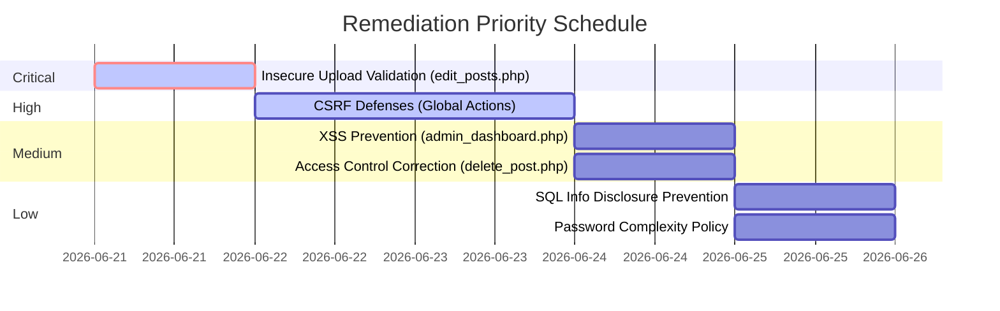

# Security Remediation Roadmap

This document outlines the security remediation plan for Calligraphy Central. In strict compliance with `PROJECT_CONSTITUTION.md` and safety guidelines, all vulnerabilities are described conceptually. No executable exploit codes, web shell payloads, or malicious filenames are included. All suggested fixes prioritize backward compatibility.

---

## Vulnerability Remediation Registry

---

### 1. [CRITICAL] Insecure File Upload Validation in Edit Mode
*   **Vulnerability ID**: SEC-001
*   **Severity**: Critical (CVSS 9.8)
*   **Affected Files**: `edit_posts.php`
*   **Root Cause**: The edit controller lacks validation checking for file extensions and MIME types when a user replaces their existing post media.
*   **Attack Vector (Conceptual)**: An authenticated user edits a post and uploads an executable script file disguised as media. Since the controller does not verify extensions, the file is saved directly to the server's uploads folder. If the web server allows execution of scripts within that folder, requesting the file's URL permits execution of commands on the hosting platform.
*   **Proposed Fix**: Implement an extension check using a whitelist of approved formats, matching the logic found in `upload.php`:
    *   Verify the file extension against an array of approved image and video extensions (such as `jpg`, `png`, and `mp4`).
    *   Validate the file type against standard MIME formats before saving the file to storage.

---

### 2. [HIGH] Missing Cross-Site Request Forgery (CSRF) Defenses
*   **Vulnerability ID**: SEC-002
*   **Severity**: High (CVSS 8.8)
*   **Affected Files**: `delete_post.php`, `like_posts.php`, `submit_comments.php`, `upload.php`, `edit_posts.php`
*   **Root Cause**: State-modifying actions do not require unique tokens associated with the user's active session.
*   **Attack Vector (Conceptual)**: An attacker tricks an authenticated user into visiting a malicious site. This external page triggers requests targeting endpoints on Calligraphy Central. Because the browser automatically includes the user's session credentials, the target application executes the commands as if the user explicitly authorized them.
*   **Proposed Fix**:
    *   Generate a secure, random CSRF token when a user starts an authenticated session.
    *   Embed this token inside a hidden field in all POST forms, and append it as a query parameter on state-modifying GET links.
    *   Validate that the incoming token matches the session value before performing database writes or file deletions.

---

### 3. [MEDIUM] Stored Cross-Site Scripting (XSS) / HTML Attribute Injection
*   **Vulnerability ID**: SEC-003
*   **Severity**: Medium (CVSS 6.1)
*   **Affected Files**: `admin_dashboard.php`
*   **Root Cause**: Database-sourced metadata strings are output directly into HTML media attributes without encoding.
*   **Attack Vector (Conceptual)**: A user uploads a file with a name containing HTML quotes and custom script attributes. When an administrator views the dashboard, the raw string is rendered, allowing the browser to escape the standard attribute structure and trigger JavaScript events in the administrator's security context.
*   **Proposed Fix**: Ensure all dynamic strings retrieved from the database are encoded using `htmlspecialchars()` before injection into HTML output attributes.

---

### 4. [MEDIUM] Broken Access Control on Deletion Action
*   **Vulnerability ID**: SEC-004
*   **Severity**: Medium (CVSS 6.5)
*   **Affected Files**: `delete_post.php`
*   **Root Cause**: The script processes parameters without checking if session authentication keys exist.
*   **Attack Vector (Conceptual)**: An unauthenticated guest accesses the delete script directly via URL query parameters. Because the guest's session is empty, variables evaluate to empty values. If the post's owner ID matches this empty value (or zero), ownership checks may pass, resulting in unauthorized deletions.
*   **Proposed Fix**: Enforce session verification checks at the top of the delete script, redirecting unauthenticated requests to the login screen.

---

### 5. [LOW] Database Query Error Information Leakage
*   **Vulnerability ID**: SEC-005
*   **Severity**: Low (CVSS 3.7)
*   **Affected Files**: `delete_post.php`, `upload.php`
*   **Root Cause**: Raw database query errors are output directly to the user response.
*   **Attack Vector (Conceptual)**: A user inputs unexpected data to trigger a query execution failure. The server returns full database query details and configuration paths, assisting the user in mapping database layouts.
*   **Proposed Fix**: Replace verbose error output with general, user-friendly notices and log the exact system errors securely to server-side logs.

---

### 6. [LOW] Loose Input Validation (Password Policy)
*   **Vulnerability ID**: SEC-006
*   **Severity**: Low (CVSS 3.7)
*   **Affected Files**: `register.php`
*   **Root Cause**: The sign-up form does not validate password length or complexity.
*   **Attack Vector (Conceptual)**: A user registers an account with a very short or weak password. The account can be easily cracked via brute force, compromising the platform's user base.
*   **Proposed Fix**: Implement validation checks in the registration script to ensure that passwords meet minimum length and structural criteria.
